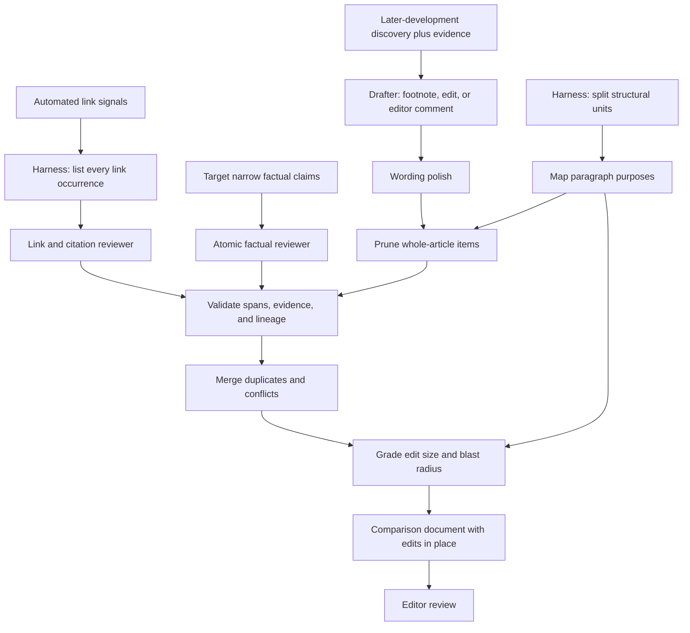

# Edit design

The reviewer finds evidence-backed ways an article could be updated or fact-checked.
It does not decide that an edit should be published.

## Edits we want

- Repair a link only when its destination is demonstrably broken, wrong, or
  superseded.
  - Preserve the visible anchor text when replacing only the destination solves the
    problem.
  - Abstain on ambiguous redirects, access failures, or replacements that require an
    editorial judgment.
- Correct a citation when its source does not support the sentence that cites it.
  - Swap the URL or trim the sentence to what the source establishes; escalate to an
    editor comment when neither honestly fixes it.
  - Do not disguise a factual rewrite as a citation change.
- Correct a narrow factual claim when a current primary source directly contradicts
  it.
  - Target dates, numbers, names, titles, policies, statuses, units, and short factual
    clauses.
  - Replace the smallest exact span that makes the claim accurate.
- Raise a later development when verified evidence, published after the article's last
  substantive update, would make a careful reader read a passage differently.
  - Covers both a qualification of one sentence and a reversal of a section
    conclusion; the size of the fix is chosen when drafting, not when discovering.
  - Draft the smallest honest scope: a footnote, a bounded edit, or an anchored editor
    comment. Bounded rewrites are allowed when the evidence entails them.
  - A finding worth an editor's attention is escalated as a comment, never dropped,
    when no article text of adequate quality can be written for it.
  - Exclude extra detail that is merely newer or interesting.

## Review flow

- The harness lists every link deterministically from the article's Markdown (one unit
  per occurrence, with offsets and any automated signal); one targeting pass lists
  every narrow factual claim. Each targeted reviewer gets the full article and its
  assigned targets.
- One reviewer checks each link's destination and whether it supports its sentence;
  another checks each factual claim. Both send corrections directly to validation.
- Batch targets by section: one call per leaf section (footnotes as their own
  sections), splitting a section only when it exceeds about 25 targets. Every call
  still receives the full article; batching is for the reviewer's attention, not to
  shrink context.
- One full-article pass discovers later developments and collects evidence; one
  drafter chooses each finding's scope; one polishing pass follows.
- The harness splits the article deterministically into structural units (paragraph,
  list item, footnote, caption) keyed by id and offsets, so repeated text never
  collides. Map each unit's purpose and argument summary from the article alone,
  immediately before pruning; discovery and drafting passes never see the map, so it
  cannot coach them past their own thresholds.
- Prune a whole-article item unless applying it would change a mapped purpose or
  summary; small corrections belong to the targeted track.
- Every stage after targeting returns only the fields it adds, keyed by unit id; the
  harness joins them onto the immutable unit record.
- Apply no numerical cap; each prompt defines which edits should survive its stage.
- Every change is one of four patch operations (see
  [conceptual units](docs/conceptual-units.md)); overlap detection and rendering use
  their spans.
- When a stage call fails outright, the harness retries it under a new call identity
  (bounded attempt number, failed trace kept) rather than replaying the failure on
  resume.
- Validation is mechanical: fields, spans, operation validity, reviewer scope, and
  recorded evidence. It never re-judges evidence.
- After merge, one grading pass reads each retained item with the purpose map and
  returns its edit class and blast radius, then the article's category by the rules in
  [edit size](docs/edit-size.md). It is the only stage that applies the pruner's
  argument test to targeted corrections; it never changes an item.

Every node that reads, drafts, polishes, or prunes article content receives the full
article; repeated context arrows are omitted below.

## Edits we do not want

- Do not suggest style, tone, formatting, SEO, or structural changes merely because
  they are possible.
- Do not add fresher examples or sources when the article's implication stays the
  same.
- Do not strengthen a claim beyond what its source establishes.
- Do not turn uncertain or owner-dependent evidence into confident replacement prose.
- Do not change the article's central argument through a local-edit prompt.
